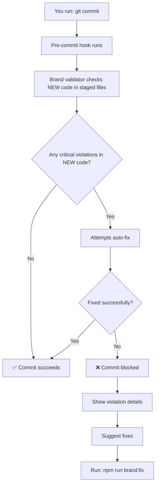

# Brand System Developer Guide

**For:** Developers working on AIUX Design Guide
**Last Updated:** November 11, 2025

---

## TL;DR (Too Long; Didn't Read)

Your commits are now **automatically validated** against the brand design system:

✅ **Automatic (No extra work for you):**
- Pre-commit hook validates your changes
- Shows helpful messages about any violations
- Suggests auto-fixes

⚠️ **What you need to know:**
- Use design tokens (like `text-primary`, `bg-surface-primary`) instead of hardcoding colors
- Use standard spacing scale (p-4, gap-6) instead of arbitrary values
- These rules are enforced on every commit

🚀 **Quick commands:**
```bash
npm run brand:check          # Check current changes
npm run brand:fix            # Auto-fix violations
npm run brand:check:all      # Full codebase audit
```

---

## How It Works

### When You Commit Code

The brand validator checks **only the new code you're committing** (staged files) against brand guidelines:



**Key Point:** The validator only checks **new code being added**. It doesn't re-validate existing components on future commits—it prevents new violations from being introduced.

### What Gets Validated

| Rule | Type | Example | Auto-Fixable |
|------|------|---------|--------------|
| Hardcoded colors | Critical | `#ff0000` → use `text-error` | ✅ Yes |
| Arbitrary spacing | Critical | `p-[13px]` → use `p-4` | ✅ Yes |
| Missing dark mode | Warning | Light mode only | ❌ No |
| Missing accessibility | Warning | No alt text or aria labels | ❌ No |

---

## Using Design Tokens

### Text Colors

Instead of hardcoding colors, use semantic tokens:

```tsx
// ❌ DON'T
<div className="text-[#0d0d0d]">Dark text</div>
<p style={{ color: '#525252' }}>Secondary</p>

// ✅ DO
<div className="text-text-primary">Dark text</div>
<p className="text-text-secondary">Secondary</p>
```

**Available text tokens:**
- `text-text-primary` – Main body text (#0d0d0d / #fafafa)
- `text-text-secondary` – Secondary content (#525252 / #a3a3a3)
- `text-text-tertiary` – Tertiary/meta content (#737373)
- `text-text-disabled` – Disabled/placeholder text (#a3a3a3 / #525252)

### Background Colors

```tsx
// ❌ DON'T
<section className="bg-[#ffffff]">
<article className="bg-white">

// ✅ DO
<section className="bg-background-primary">
<article className="bg-surface-primary">
```

**Available background tokens:**
- `background-primary` – Page background
- `background-secondary` – Secondary sections
- `background-tertiary` – Hover states
- `surface-primary` – Cards, containers
- `surface-secondary` – Nested elements
- `surface-elevated` – Floating elements (modals, popovers)

### Border Colors

```tsx
// ❌ DON'T
<div className="border border-[#f9f9f9]">
<input className="border-2 border-red-600" />

// ✅ DO
<div className="border border-border-primary">
<input className="border-border-error" />
```

**Available border tokens:**
- `border-primary` – Main borders
- `border-secondary` – Subtle dividers
- `border-focus` – Focus states
- `border-success`, `border-error`, `border-warning`, `border-info` – States

### Semantic State Colors

For errors, success, warnings, and info:

```tsx
// Success state
<div className="border-border-success text-success">✓ Saved</div>

// Error state
<div className="border-border-error text-error">✗ Error</div>

// Warning state
<div className="border-border-warning text-warning">! Warning</div>

// Info state
<div className="border-border-info text-info">ℹ Info</div>
```

### Category Colors (For Accents)

Used only for icons, accent elements, and visual differentiation:

```tsx
// ✅ For pattern category icons
<div className="text-category-blue">Feature icon</div>
<div className="bg-category-purple">Pattern badge</div>

// Available tokens: blue, purple, amber, teal, indigo, green, rose, orange, cyan, emerald, violet, pink, slate, neutral
```

---

## Using Spacing System

### Standard Spacing Scale

Always use Tailwind's default spacing scale. **No arbitrary values:**

```tsx
// ❌ DON'T
<div className="p-[13px] m-[23px] gap-[17px]">

// ✅ DO
<div className="p-4 m-6 gap-4">
```

**Common spacing values:**
- `p-3` – Small padding (0.75rem)
- `p-4` – Default padding (1rem)
- `p-5` – Card padding (1.25rem)
- `p-6` – Larger padding (1.5rem)
- `gap-3` – Small gaps
- `gap-4` – Default gaps
- `gap-6` – Larger gaps
- `space-y-4` – Vertical spacing between children
- `space-y-6` – Larger vertical spacing

### Buttons

All buttons must use the `Button` component from the design system.

```tsx
import Button from '@/components/ui/Button'

// Primary button (filled with brand black)
<Button variant="primary">
  Get Started
</Button>

// Secondary button (black border)
<Button variant="secondary">
  Learn More
</Button>

// Outline button (subtle border)
<Button variant="outline">
  Cancel
</Button>

// Sizes
<Button size="sm">Small</Button>
<Button size="md">Medium (default)</Button>
<Button size="lg">Large</Button>

// Other options
<Button fullWidth>Full Width</Button>
<Button disabled>Disabled</Button>
```

**Features:**
- ✅ Uses brand black (`accent-primary`) for primary/secondary
- ✅ Uses design tokens for all colors
- ✅ Proper hover and focus states
- ✅ Disabled state handling
- ✅ Dark mode support built-in
- ✅ Three sizes: `sm`, `md`, `lg`

### Search Bars

All search inputs must use the `UnifiedSearchBar` component for consistency.

```tsx
import UnifiedSearchBar from '@/components/ui/UnifiedSearchBar'

<UnifiedSearchBar
  placeholder="Search patterns..."
  value={searchQuery}
  onChange={setSearchQuery}
  size="md"           // 'sm' | 'md' | 'lg'
  isLoading={false}   // Show loading spinner
  disabled={false}    // Disable input
/>
```

**Features:**
- ✅ Uses all design tokens (colors, spacing, focus states)
- ✅ Automatic clear button (appears when input has text)
- ✅ Loading state indicator
- ✅ Keyboard navigation (Enter to submit)
- ✅ Dark mode support built-in
- ✅ Three sizes: `sm`, `md`, `lg`

### Card Spacing Pattern

Standard pattern for all cards:

```tsx
// ✅ Card pattern
<div className="rounded-xl p-5 bg-surface-primary border border-border-primary shadow-sm hover:shadow-md transition-shadow">
  <h3 className="text-xl font-semibold text-text-primary">Title</h3>
  <p className="text-sm text-text-secondary mt-4">Content</p>
</div>
```

Key elements:
- **Rounded:** `rounded-xl` (always 16px)
- **Padding:** `p-5` (1.25rem standard)
- **Border:** `border border-border-primary`
- **Shadow:** `shadow-sm` default, `shadow-md` on hover
- **Background:** `bg-surface-primary`

---

## Real-World Examples

### Example 1: Buttons with Correct Styling

```tsx
import Button from '@/components/ui/Button'

export function CTA() {
  return (
    <div className="flex gap-4">
      {/* Primary action - filled brand black */}
      <Button
        variant="primary"
        size="lg"
        onClick={() => navigate('/signup')}
      >
        Get Started
      </Button>

      {/* Secondary action - black border */}
      <Button
        variant="secondary"
        size="lg"
        onClick={() => navigate('/learn')}
      >
        Learn More
      </Button>

      {/* Tertiary action - subtle border */}
      <Button
        variant="outline"
        onClick={() => close()}
      >
        Cancel
      </Button>
    </div>
  )
}
```

### Example 2: Patterm Card Component

```tsx
import { motion } from 'framer-motion'

export function PatternCard({ pattern }) {
  return (
    <motion.div
      className="rounded-xl p-5 bg-surface-primary border border-border-primary shadow-sm hover:shadow-md transition-shadow cursor-pointer"
      whileHover={{ y: -4 }}
    >
      <div className="flex items-center gap-3 mb-3">
        <span className={`text-2xl text-category-${pattern.color}`}>
          {pattern.icon}
        </span>
        <h3 className="text-lg font-semibold text-text-primary">
          {pattern.title}
        </h3>
      </div>

      <p className="text-sm text-text-secondary mb-4">
        {pattern.description}
      </p>

      <div className="flex gap-3">
        <button className="px-4 py-2 bg-accent-primary text-white rounded-lg hover:bg-accent-hover transition-colors">
          Learn More
        </button>
        <button className="px-4 py-2 border border-border-primary text-text-primary rounded-lg hover:bg-background-tertiary transition-colors">
          Explore
        </button>
      </div>
    </motion.div>
  )
}
```

### Example 2: Form Input with Validation

```tsx
export function FormInput({ label, error, required }) {
  return (
    <div className="space-y-2">
      <label className="text-sm font-medium text-text-primary">
        {label}
        {required && <span className="text-error ml-1">*</span>}
      </label>

      <input
        className={`w-full px-4 py-2 rounded-lg border transition-colors ${
          error
            ? 'border-border-error bg-white text-text-primary placeholder-text-disabled focus:ring-2 focus:ring-ring-focus-error'
            : 'border-border-primary bg-surface-primary text-text-primary placeholder-text-disabled focus:ring-2 focus:ring-ring-focus'
        }`}
        placeholder="Enter value..."
      />

      {error && (
        <p className="text-xs text-error">{error}</p>
      )}
    </div>
  )
}
```

### Example 3: Search Bar with Pattern Search

```tsx
import { useState, useMemo } from 'react'
import UnifiedSearchBar from '@/components/ui/UnifiedSearchBar'

export function PatternSearchPage() {
  const [searchQuery, setSearchQuery] = useState('')

  const filteredPatterns = useMemo(() => {
    return patterns.filter(pattern =>
      pattern.title.toLowerCase().includes(searchQuery.toLowerCase()) ||
      pattern.description.toLowerCase().includes(searchQuery.toLowerCase())
    )
  }, [searchQuery])

  return (
    <div>
      {/* Search Bar - Standardized across all pages */}
      <UnifiedSearchBar
        placeholder="Search patterns..."
        value={searchQuery}
        onChange={setSearchQuery}
        size="md"
      />

      {/* Pattern Results */}
      {filteredPatterns.map(pattern => (
        <div key={pattern.id} className="rounded-xl p-5 bg-surface-primary border border-border-primary">
          <h3 className="text-lg font-semibold text-text-primary">
            {pattern.title}
          </h3>
          <p className="text-sm text-text-secondary mt-2">
            {pattern.description}
          </p>
        </div>
      ))}
    </div>
  )
}
```

### Example 4: Dark Mode Support

```tsx
export function DarkModeExample() {
  return (
    <div className="bg-background-primary dark:bg-background-primary text-text-primary dark:text-text-primary">
      {/* Background automatically switches via CSS variables */}
      {/* Most tokens already have dark mode built-in */}

      <div className="rounded-xl p-5 bg-surface-primary border border-border-primary">
        <h3 className="text-lg font-semibold text-text-primary">
          This automatically works in dark mode!
        </h3>
      </div>

      {/* Only add dark: prefix if you need custom light/dark values */}
      <button className="bg-white dark:bg-slate-900 text-black dark:text-white">
        Custom colors
      </button>
    </div>
  )
}
```

---

## When Brand Validation Runs

### Pre-Commit (Automatic)

Your **new code** is validated whenever you commit:

```bash
$ git commit -m "Add new pattern card"
🎨 Validating brand design system...
✓ Brand validation passed (0.8s)
[main abc1234] Add new pattern card
```

**Note:** Only the new/changed code in this commit is validated. Existing components aren't re-checked on future commits.

### Manual Checks

Check your code anytime:

```bash
# Check just your staged changes
npm run brand:check

# Check entire codebase
npm run brand:check:all

# Auto-fix violations
npm run brand:fix
```

---

## Handling Violations

### When You See a Brand Error

```
❌ CRITICAL Brand Violations (commits blocked):

  src/components/NewButton.tsx:12
    ✗ Hardcoded color instead of design tokens
      className="text-[#ff0000]"
    ✓ Fix: text-error

  src/components/Card.tsx:24
    ✗ Arbitrary spacing value
      className="p-[13px]"
    ✓ Suggestion: p-4
```

### Fixing Violations

**Option 1: Auto-fix (Recommended)**
```bash
npm run brand:fix
# Auto-fixes automatically fixable violations
# Then make sure tests still pass
npm test
```

**Option 2: Manual fix**
- Read the suggestion in the error message
- Make the change manually in your code
- Commit again

### Example: Fixing Hardcoded Colors

```tsx
// ❌ Before (violation)
<div className="text-[#ef4444]">Error message</div>

// ✅ After (fixed)
<div className="text-error">Error message</div>
```

### Example: Fixing Arbitrary Spacing

```tsx
// ❌ Before (violation)
<div className="p-[13px] m-[8px] gap-[17px]">

// ✅ After (fixed)
<div className="p-4 m-3 gap-4">
```

---

## Brand Guidelines Reference

For complete details on the design system, see **[BRAND_GUIDELINES.md](./BRAND_GUIDELINES.md)**:

- **Complete color palette** with hex values
- **Typography scale** and font weights
- **Component patterns** (buttons, cards, forms)
- **Critical vs Warning rules**
- **Accessibility requirements**
- **Dark mode implementation**

---

## Troubleshooting

### "Pre-commit hook failed"

**Problem:** Your commit was blocked due to brand violations.

**Solution:**
```bash
# 1. Auto-fix what can be fixed
npm run brand:fix

# 2. Manually fix remaining violations
# (Check git diff to see what was changed)

# 3. Stage the fixed files
git add -A

# 4. Try committing again
git commit -m "Your message"
```

### "Some violations weren't auto-fixed"

**Problem:** The validator found violations that require manual fixing.

**Solution:**
```bash
# 1. Check what violations exist
npm run brand:check

# 2. Read the violation descriptions
# 3. Fix them manually in your editor
# 4. Commit again
```

### "I need to break a brand rule"

**Exceptions are allowed** but require documentation:

```tsx
// BRAND EXCEPTION: Custom animation requires #ff6b6b
// Approved by: design team, Date: 2025-11-11
<div style={{ color: '#ff6b6b' }} />
```

**Requirements for exceptions:**
1. ✅ Documented with `// BRAND EXCEPTION:` comment
2. ✅ Include reason why
3. ✅ Note approval and date
4. ✅ Pre-commit hook will show warning but allow commit

### "How do I disable the pre-commit hook?"

**Don't** (it exists for a reason), but if you must:

```bash
# Skip the hook (not recommended)
git commit --no-verify

# If you do this, run the validator manually:
npm run brand:check
```

---

## Best Practices

### ✅ DO:

1. **Check before committing**
   ```bash
   npm run brand:check
   ```

2. **Use existing components**
   - Button, Card, Form inputs already use proper tokens
   - Copy-paste from similar components

3. **Follow the pattern**
   - Look at existing pattern pages for reference
   - Cards: `rounded-xl p-5 bg-surface-primary border border-border-primary`
   - Text: Use `text-text-primary`, `text-text-secondary`, etc.

4. **Ask for help**
   - Questions about tokens? Check BRAND_GUIDELINES.md
   - Stuck on implementation? Look at src/components/ui/

### ❌ DON'T:

1. **Don't hardcode colors**
   - ❌ `#ff0000`, `rgb(255, 0, 0)`, `red-600`
   - ✅ `text-error`, `border-success`

2. **Don't use arbitrary spacing**
   - ❌ `p-[13px]`, `m-[23px]`, `gap-[17px]`
   - ✅ `p-4`, `m-6`, `gap-4`

3. **Don't ignore validation errors**
   - They're there to help you
   - Run `npm run brand:fix` if unsure

4. **Don't create new color tokens**
   - Use existing tokens from BRAND_GUIDELINES.md
   - Request new tokens through design team

---

## Resources

| Resource | Link | Purpose |
|----------|------|---------|
| Brand Guidelines | `docs/BRAND_GUIDELINES.md` | Complete design system reference |
| UI Components | `src/components/ui/` | Ready-to-use components |
| Example Patterns | `src/data/patterns/` | Real implementation examples |
| Design Tokens | `src/app/globals.css` | CSS variables |
| Tailwind Config | `tailwind.config.mjs` | Extended color tokens |

---

## Summary

Your brand design system is now **automatically enforced** on every commit:

✅ **Automatic validation** – Pre-commit hook checks your code
✅ **Helpful messages** – Clear explanations of violations
✅ **Auto-fixes** – Common violations fixed automatically
✅ **Non-blocking** – Warnings don't block commits (critical violations do)

**Three key rules:**
1. Use design tokens (no hardcoded colors)
2. Use standard spacing scale (no arbitrary values)
3. Use design system components

That's it! Happy coding! 🎨

---

**Questions?** Check [BRAND_GUIDELINES.md](./BRAND_GUIDELINES.md) or create an issue with the `brand-system` label.
